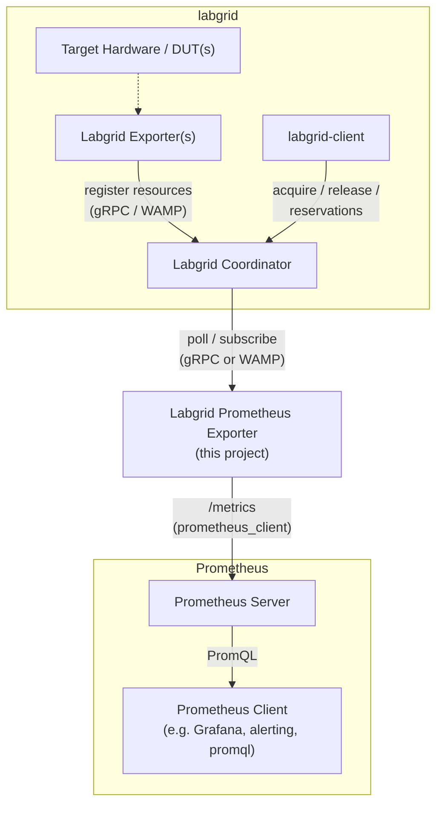

<div align="center">


# labgrid-prometheus-exporter

*Prometheus exporter for the labgrid embedded-testing coordinator.*

[](LICENSE)
[](pyproject.toml)
[](https://prometheus.io/)
[](https://www.docker.com/)
[](https://docs.astral.sh/uv/)
[](https://github.com/honeytreelabs/labgrid-prometheus-exporter/commits/main)

**[Metrics](#metrics)** ·
**[Example PromQL queries](#example-promql-queries)** ·
**[Architecture](#architecture)** ·
**[Installation](#installation)** ·
**[Usage](#usage)** ·
**[Docker images](#docker-images)** ·
**[Development](#development)** ·

</div>

labgrid-prometheus-exporter is an adapter between a running
[labgrid](https://github.com/labgrid-project/labgrid/) coordinator and the
[Prometheus](https://prometheus.io/) metrics protocol: it reads the
coordinator's state (place utilization and turnover, resource
availability, reservation queue depth) and exposes it as Prometheus
metrics, alongside the exporter's own connection health (see
[Metrics](#metrics)). Point it at your coordinator, scrape `/metrics`, and
use whatever you already use for Prometheus data: dashboards, alerting,
ad-hoc PromQL.

It supports both labgrid coordinator generations, WAMP (releases up to
24.x) and gRPC (releases from 25.0 onwards), via one of two backend
packages selected at install time — see [Layout](#layout).

## Metrics

All metrics are prefixed `labgrid_`. Grouped by topic below; see
[Example PromQL queries](#example-promql-queries) for how to combine them.

### Utilization

| Metric | Type | Labels | Description |
| --- | --- | --- | --- |
| `labgrid_place_acquired` | Gauge | `place` | Whether a place is currently acquired (`1`) or free (`0`). |
| `labgrid_place_changed_timestamp_seconds` | Gauge | `place` | Unix timestamp of the last change to a place. |
| `labgrid_place_acquired_seconds` | Gauge | `place` | How long a place has been continuously acquired. Absent while the place is free. |
| `labgrid_places_acquired_by_user` | Gauge | `user` | Number of places currently acquired by a user. Absent for users holding none. |
| `labgrid_place_tag_info` | Gauge | `place`, `key`, `value` | Presence of a labgrid place tag, one series per `(place, key)`. Value is always `1`. |

These are all refreshed and cleaned up together on every poll: a place
that's released, deleted, or has a tag removed/changed stops appearing in
the corresponding series immediately rather than lingering with a stale
value. This matters most for tags, since they commonly gate which places
Continuous Integration (CI) is allowed to use.

### Self-health

| Metric | Type | Labels | Description |
| --- | --- | --- | --- |
| `labgrid_coordinator_connected` | Gauge | – | Whether this Prometheus exporter's connection to the labgrid coordinator is currently live. |
| `labgrid_places_last_update_timestamp_seconds` | Gauge | – | Unix timestamp of the last time place metrics were refreshed from the backend. |

Alert on either of these rather than assuming metrics are always fresh (see [Reconnection](#reconnection)).

### Turnover

| Metric | Type | Labels | Description |
| --- | --- | --- | --- |
| `labgrid_place_acquire_total` | Counter | `place` | Total number of times a place has transitioned from free to acquired. |
| `labgrid_place_release_total` | Counter | `place` | Total number of times a place has transitioned from acquired to free. |

Unlike the utilization gauges above, these are *not* removed when a place
is deleted. They're historical totals, not current state. A place
deleted while acquired doesn't count as a release.

### Resource and reservation detail

| Metric | Type | Labels | Description |
| --- | --- | --- | --- |
| `labgrid_resource_available` | Gauge | `labgrid_exporter`, `group`, `name`, `cls` | Whether a labgrid resource is currently available (`1`) or not (`0`). `labgrid_exporter` identifies the upstream labgrid exporter process that registered it, not this Prometheus exporter. |
| `labgrid_reservations_pending` | Gauge | – | Number of reservations currently waiting for a place. |
| `labgrid_reservation_wait_seconds` | Gauge | – | How long the oldest pending reservation has been waiting, in seconds. `0` if none are pending. |

Unlike places and resources, labgrid never pushes reservation updates on
either transport, so this data is refreshed via a real coordinator call
every poll, independent of the other metrics above. Reservations are also
deliberately unlabeled: a reservation's token is random per request and
unsuitable as a label.

## Example PromQL queries

```promql
# How many places are currently acquired, at all.
sum(labgrid_place_acquired)

# Free places tagged for CI use -- what's actually available to a CI job
# right now, not just what's tagged for it.
labgrid_place_tag_info{key="usage", value="ci"} == 1
  and on(place) labgrid_place_acquired == 0

# Places held for more than 4 hours -- likely a forgotten/stuck acquisition
# rather than an active test run.
labgrid_place_acquired_seconds > 4 * 3600

# The 5 users currently holding the most places.
topk(5, labgrid_places_acquired_by_user)

# Acquisitions per hour over the last hour, fleet-wide -- turnover, not
# just current occupancy.
sum(rate(labgrid_place_acquire_total[1h])) * 3600

# Acquired places that were never given a usage tag at all -- a
# governance/hygiene check, crosscutting labgrid_place_acquired against
# the *absence* of a matching labgrid_place_tag_info series.
labgrid_place_acquired == 1
  unless on(place) labgrid_place_tag_info{key="usage"}

# Resources a labgrid exporter has registered but currently reports
# unavailable.
labgrid_resource_available == 0

# Reservations that have been waiting more than 10 minutes.
labgrid_reservation_wait_seconds > 600

# This Prometheus exporter's own health: alert on either the connection
# flag or on metrics simply going stale, since a wedged poll loop and a
# reported disconnect aren't quite the same failure mode.
labgrid_coordinator_connected == 0
  or (time() - labgrid_places_last_update_timestamp_seconds) > 60
```

The `and on(place)` / `unless on(place)` examples above are the general
pattern for crosscutting these metrics: join on the shared `place` label
to combine current state (`labgrid_place_acquired`) with metadata
(`labgrid_place_tag_info`) that lives on a separate series with its own
label set.

## Architecture

One coordinator sits at the center of the labgrid side: `labgrid-client`
acquires/releases places and reads reservations from it, while each
`labgrid-exporter` process registers the hardware resources (behind actual
target hardware, dotted since it's outside this repo) it manages with it.

This project is a separate, long-lived process that polls (gRPC) or
subscribes to (WAMP) that same coordinator, translates its state into
Prometheus metrics via the `prometheus_client` library, and serves them
over HTTP for a normal Prometheus server to scrape. Everything downstream
of that (Grafana, alerting, ad-hoc PromQL) is a regular Prometheus client
with no labgrid-specific knowledge at all
([Figure 1](#fig-1-architecture)).

<a name="fig-1-architecture"></a>



*Figure 1: High-level architecture - labgrid-side actors and coordinator
on the left, this project bridging to Prometheus and its own consumers on
the right.*

## Installation

Sync only `core`, `meta`, and the one backend matching your coordinator's
labgrid version. A plain `uv sync` at the repository root will fail
because it would otherwise need both backends at once:

```sh
uv sync --package labgrid-prometheus-exporter-core \
        --package labgrid-prometheus-exporter \
        --package labgrid-prometheus-exporter-backend-grpc  # or -backend-wamp
```

## Usage

Run the Prometheus exporter command:

```sh
uv run --no-sync labgrid-prometheus-exporter --coordinator 127.0.0.1:20408   # grpc
uv run --no-sync labgrid-prometheus-exporter --crossbar ws://127.0.0.1:20408/ws  # wamp
```

## Docker images

`make docker-build` builds the root `Dockerfile` for each backend variant
(passing `BACKEND=grpc` / `BACKEND=wamp` as a build arg. See
[Layout](#layout) for why they can't be combined into one image), tagging
both as `<IMAGE_REGISTRY>/<IMAGE_NAME>:<IMAGE_TAG>-<backend>`.
`make docker-push` pushes both (run `docker login` yourself first; the
Makefile doesn't do that for you), and `make docker-publish` does both in
one step:

```sh
make docker-build
make docker-publish IMAGE_TAG=1.0.0
```

`IMAGE_REGISTRY`, `IMAGE_NAME`, and `IMAGE_TAG` default to
`ghcr.io/example`, `labgrid-prometheus-exporter`, and `latest`
respectively, and are overridable on the command line as shown above.

## Reconnection

Neither labgrid transport's `ClientSession` reconnects on its own once its
connection to the coordinator ([Figure 1](#fig-1-architecture)) drops (a
coordinator restart during a deployment, a network blip, ...). That's
expected for labgrid's own tooling, which is one-shot and short-lived, but
not acceptable for a Prometheus exporter meant to run unattended for a
long time. So this exporter's poll loop detects the drop itself and
retries `connect()` on its own regular poll interval - no separate
backoff schedule, no manual restart needed.

Two things follow operationally: `labgrid_coordinator_connected` drops to
`0` for the duration of an outage, so alert on that (and on
`labgrid_places_last_update_timestamp_seconds` going stale) rather than
assuming metrics are always fresh. And place-level metrics
(`labgrid_place_acquired`, `labgrid_place_tag_info`, ...) intentionally
keep reporting their last-known values throughout the outage instead of
being cleared. A brief disconnect isn't the same as those places actually
being released or untagged, and clearing them would be actively misleading
to anything (dashboards, CI gating) reading those metrics.

## Development

`make test` and `make type-check` loop over both backend variants, syncing
each in turn (see the Makefile). A single whole-tree `uv run pytest` won't
work for the same reason a single `uv sync` won't.

```sh
make test
make type-check
```

### Integration tests

`make test-integration` builds and runs a real labgrid coordinator plus a
real labgrid exporter (both from labgrid's own `dockerfiles/`, pinned to
the exact tag each backend is tested against. The integration tests do
not pulled from a registry), alongside a real
`labgrid-prometheus-exporter` container under test, via Docker Compose
(`docker-compose.grpc.yml` / `docker-compose.wamp.yml`, services
`coordinator` / `labgrid-exporter` / `prometheus-exporter`
respectively). It drives the coordinator with `labgrid-client` and
scrapes the Prometheus exporter's `/metrics` for real
(`tests/integration/`). It's slow and needs Docker, so unlike `make
test` it's **not** run by the pre-commit hook or on every commit.
Better, run it explicitly, or from CI on a schedule/PR.

```sh
make test-integration
```

Build all package artifacts:

```sh
uv build --all-packages
```

### Layout

[Labgrid](https://github.com/labgrid-project/labgrid/)'s coordinator
protocol changed from WAMP (releases up to 24.x) to gRPC (releases from
25.0 onwards) as a hard, backwards-incompatible break. Since one
[Prometheus](https://prometheus.io/) exporter deployment only ever talks
to one coordinator whose labgrid version is known in advance, this
project is split into a transport-agnostic core and one backend package
per labgrid protocol generation, rather than trying to support every
transport in one process.

This is a [uv workspace](https://docs.astral.sh/uv/concepts/projects/workspaces/):

- `packages/core`... Prometheus metric definitions, HTTP server
  wiring, and the `CoordinatorBackend` contract. Has no dependency on
  `labgrid` itself.
- `packages/backend-grpc` ... implements `CoordinatorBackend` for
  labgrid's gRPC protocol (labgrid >= 25.0) by wrapping labgrid's own
  `ClientSession`. A pure library, no console script.
- `packages/backend-wamp` ... the same, for labgrid's WAMP/crossbar
  protocol (labgrid < 25.0).
- `packages/meta` ... the package end users actually install. Owns the
  `labgrid-prometheus-exporter` console script and discovers, at
  runtime, whichever single backend extra was installed.

`backend-grpc` and `backend-wamp` require incompatible `labgrid` ranges, so
they're declared as conflicting workspace members
([tool.uv] conflicts in this file's pyproject.toml): `uv` refuses to sync
both into the same environment. That's enforced at sync time, on top of the
runtime check in `labgrid_prometheus_exporter.backends`. See
[packages/meta/README.md](packages/meta/README.md) for more information.

## Disclosure: AI-Assisted Development

This project is in large parts AI-generated code. However, humans
manage the architecture and perform code reviews of those parts which
are generated by AI.
